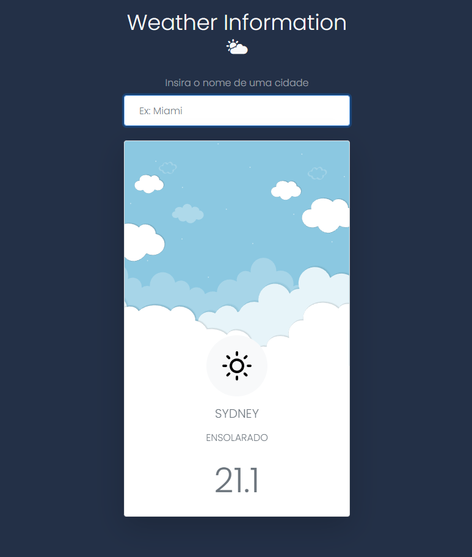

<h2>About the project</h2>

  
A <b>Weather Watchman ☀️ </b>é a sua janela para o mundo, fornecendo informações meteorológicas abrangentes e atualizadas para cidades e países em todo o globo. Com esta aplicação intuitiva e poderosa, você terá acesso instantâneo a previsões precisas do tempo, detalhes climáticos e muito mais, para qualquer lugar que você escolher explorar. 
  <b>Weather Watchman ☀️ </b> é a sua bússola digital para o clima global🌎. Seja para planejar uma viagem ✈️, acompanhar o clima na sua área local ou simplesmente satisfazer sua curiosidade sobre o mundo, estamos aqui para ajudar. Visite Weather Watchman linkado abaixo hoje e esteja sempre preparado para o que o tempo lhe reserva.

👉 Live Demo: <a href='https://weatherwatchman.netlify.app/'>Live Demo</a>

<h3>🔧 Tools:</h3>

» Bootstrap
» JavaScript

<h2>Screenshots of the Project 📸</h2>
 
<h3 align='center'>Home Page 🏡</h3>

